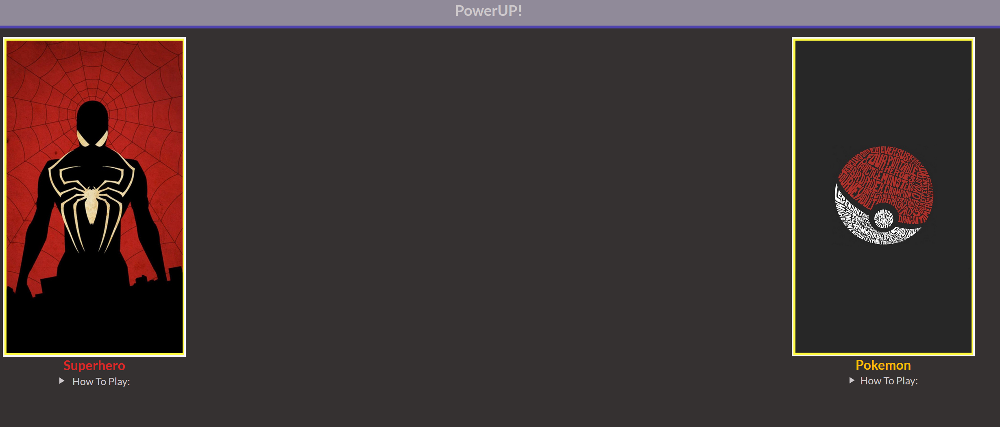
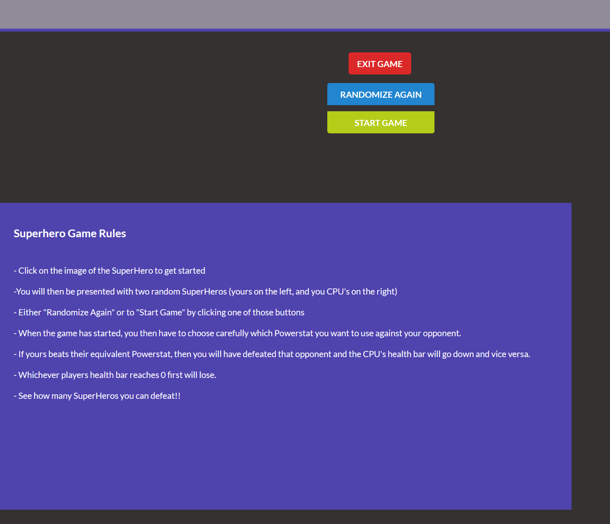
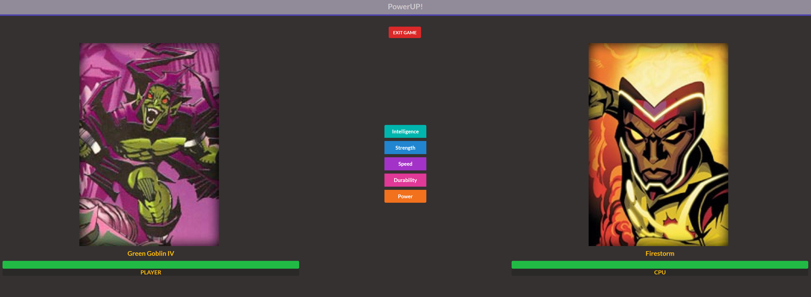
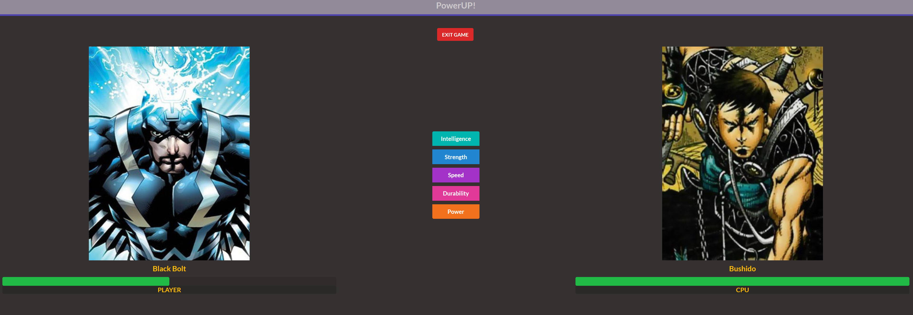
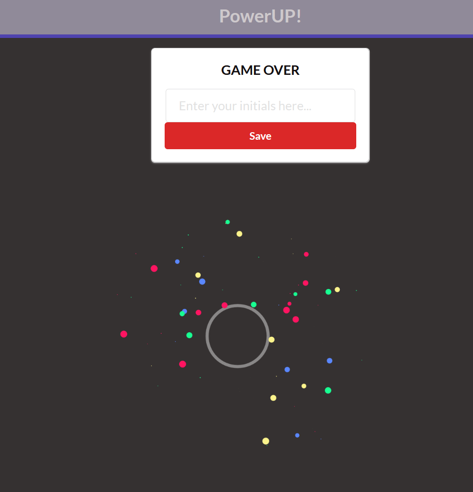

# POWER UP

## Table of contents

- [Team Members](#team-members)
- [Access](#access)
- [Technologies](#technologies)
- [How To Use](#how-to-use)
- [Screenshots](#screenshots)

## Team Members

- Stephanie Morrissey
- Corey Clarke
- Adnan Ghafoor

## Access

- The PowerUp App can be accessed from the following web address: https://steph-morrissey.github.io/powerup/

## Technologies

- Semantic UI v2.4.2: https://semantic-ui.com/
- Anime.js v3.0: https://animejs.com/
- SuperHero API: https://superheroapi.com/
- PokeAPI: https://pokeapi.co/

## How To Use

- The PowerUP can be accessed by following the link within the [Access](#access) section
- For information on how to play as either universe, follow the instructions located in the How To Play links on the homepage

## Screenshots

Universe Start Screen

Selected Universe Screen

SuperHero Universe Screen

SuperHero Screen with health bar loss

Final Score Screen

## Credits

Built and designed by Null Events Inc.
